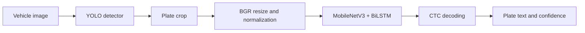

# Vietnamese License Plate OCR & ANPR

A computer vision project focused on fine-tuning a **CRNN license plate recognizer**, integrating it with an existing YOLO detector, and making experiments reproducible.

**Release scope:** source code, tests and documentation. Model weights and raw datasets are not bundled. Company-provided evaluation material and results are not published. Inference requires authorized weights; data-free tests can run immediately.



## What I worked on

- Fine-tuning OCR with MobileNetV3, a bidirectional LSTM and CTC loss.
- Combining real and synthetic training sources and investigating difficult cases.
- Auditing duplicate images, conflicting labels, vocabulary coverage and split overlap.
- Building traceable training runs with frozen configs, dictionaries, manifests and hashes.
- Integrating detection and recognition through a CLI, Streamlit interface and FastAPI endpoint.
- Fixing preprocessing/export inconsistencies and final-batch handling in the local training engine.

YOLO, PaddleOCR and the neural network architectures are reused components. This project contributes the adaptation, experiments, data tooling and application integration.

## Quick start: source and tests

Use Python **3.9** for the legacy Paddle 2.5 runtime. From the repository root:

```bash
python -m venv .venv
# Linux/macOS: source .venv/bin/activate
# Windows PowerShell: .\.venv\Scripts\Activate.ps1
python -m pip install -e ".[test]"
python -m unittest discover -s tests -v
python scripts/check_release.py
python -m plateocr --help
```

The test extra does not install Paddle or require model weights. The GitHub Actions workflow runs these tests; its remote status is only established after pushing and running the workflow.

For OCR inference, install `requirements-ocr-cpu.txt`. For YOLO, Streamlit and the API, install `requirements-cpu.txt` in a separate runtime environment (the test extra uses headless OpenCV). These pins match the locally tested legacy runtime; fresh installation on every platform has not been verified.

## Models and demo

Obtain weights only from an authorized source. There is no approved public download in this release. See [setup](docs/SETUP.md) for expected files and verification:

```bash
python scripts/verify_assets.py
python scripts/generate_example.py
python -m plateocr infer data/examples/fictional_plate.png --model model92
python -m streamlit run app.py
python -m uvicorn api:app --host 127.0.0.1 --port 8000
```

The generated image is a fictional input for demonstrating the workflow, not an accuracy benchmark. The application supports user-supplied plate crops and vehicle images; `--detect` enables YOLO before OCR. The API accepts `POST /anpr` with `{"image_base64": "..."}` and returns all detected plates, text and separate detection/OCR confidence values.

## Training and evaluation

OCR uses **BGR, `[3, 48, 256]`**, aspect-preserving resize and padding. SVTR experiments using different image sizes are not part of this baseline.

Training data source supplied by the author: [Vietnamese License Plate OCR on Kaggle](https://www.kaggle.com/datasets/topkek69/vietnamese-license-plate-ocr/data). Download from the original source and follow its terms; the repository does not redistribute the dataset. Source licensing and the exact mapping of historical generated/augmented images still require documentation.

```bash
python -m plateocr prepare-data --seed 42
python -m plateocr audit --decode
python -m plateocr prepare-train --cpu --epochs 80 --batch-size 32
# Replace RUN with the path printed by prepare-train:
python -m plateocr train RUN
python -m plateocr eval RUN
python -m plateocr export RUN
python -m plateocr register-model my-crnn EXPORT_RUN
python -m plateocr evaluate --model my-crnn --manifest labels.txt --data-root images
```

See [setup](docs/SETUP.md), [dataset card](docs/DATASET_CARD.md) and [model card](docs/MODEL_CARD.md). Training requires the local PaddleOCR dependencies in addition to the inference runtime. `--pretrained` starts a new fine-tune; `--resume` restores optimizer/epoch state. Do not edit a prepared run's config; prepare a new run.

Evaluation reports full-plate exact-match accuracy and CER. Failed images remain in the denominator. OCR-on-crop performance is distinct from end-to-end ANPR performance. No company-test metrics are claimed in this public release while disclosure permission is unknown.

## Repository layout

```text
plateocr/             data, inference, evaluation, training, CLI
configs/             portable project defaults
models/              dictionary and model metadata; weights excluded
data/                local datasets and versioned manifests; excluded
runs/                local run snapshots, logs and checkpoints; excluded
tests/               unit and API contract tests
scripts/             export, asset verification and release tooling
vendor/PaddleOCR/    local engine, license and modification notes
docs/                setup, model/data cards and publication notes
app.py / api.py       Streamlit and FastAPI entry points
```

## Validation and limitations

The local project has passed unit/API tests, initial Streamlit rendering, inference with existing weights, and a small train → validation → export → reload integration test. That smoke test establishes execution, not model quality. A full new fine-tune, clean-install verification across platforms and public hosting have not been completed.

Original-code licensing and weight redistribution permissions remain to be selected/confirmed. Third-party licenses remain applicable: see [notices](docs/THIRD_PARTY_NOTICES.md). Do not publish local datasets, predictions or reports when preparing a release; use the allowlisted export described in [publication](docs/PUBLICATION.md).
